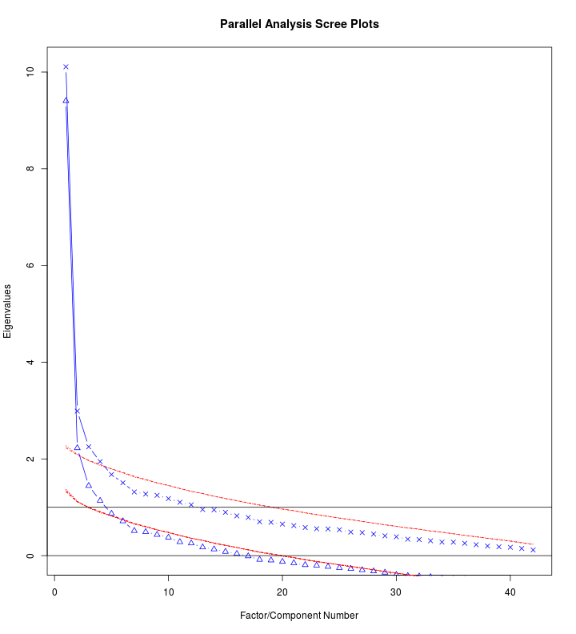
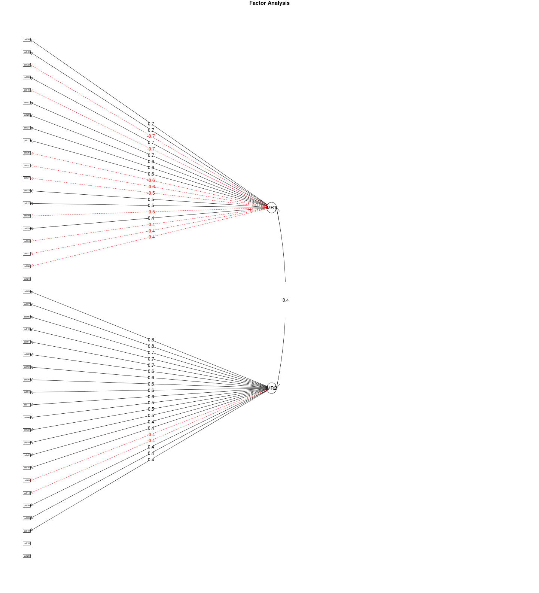

Escala de Percepção Social do Uso de Drogas - Análise preliminar
========================================================

Este relatório objetiva apresentar as análises introdutória do instrumento ``Escala de percepção social do uso de drogas'', que está em fase de desenvolvimento pelo Centro de Referência em Pesquisa, Intervenção e Avaliação em Álcool e Outras Drogas (http://www.ufjf.br/crepeia/).

O instrumento está sendo validado para população de educadores. O objetivo da pesquisa é oferecer uma medida confiável para avaliação da percepção social de educadores de um curso à distância oferecido pela Secretaria Nacional de Políticas sobre Drogas para aproximadamente 10.000 educadores dos estados de Minas Gerais e Rio de Janeiro.

Durante todo o processo de desenvolvimento, foram utilizadas ferramentas de código-aberto, para facilitar o re-uso das técnicas e procedimentos desenvolvidos. Todo conteúdo do instrumento e de suas etapas estará disponível para o público no repositório (http://github.com/crepeia/ead-senad). Atualmente, o projeto está hospedado no repositório (http://github.com/henriquepgomide/ead-senad). 

Neste relatório são apresentadas, análises da escala com base em uma amostra de 141 educadores-tutores do curso. As análises foram conduzidas através da linguagem de programação R usando os pacotes *car* e *psych*. 

Banco de Dados
-------------------------

O banco de dados da pesquisa, pode ser obtido no seguinte endereço: (https://github.com/henriquepgomide/ead-senad/blob/master/percepcaosocial_df.csv).

Resultados
-------------------------

Os resultados são apresentados por tópicos: caracterização da amostra, avaliação descritiva da escala e análise fatorial exploratória.


### Bibliotecas

```r
library(car)  # Function Recode
library(psych)  # Function Describe
```

```
## 
## Attaching package: 'psych'
## 
## The following object is masked from 'package:car':
## 
##     logit
```

```r
socialPer <- read.csv("percepcaosocial_df.csv")
## Summing scales to remove NA's
socialPer$scaleSum <- rowSums(socialPer[, 24:64])
## Subset completed observations and consented participation
socialPer <- subset(socialPer, subset = socialPer$termo == "Sim" & socialPer$estado == 
    "Finalizadas" & !is.na(socialPer$scaleSum))
```


### Sócio-demográficas

#### Idade

```r
summary(socialPer$age)  # all
```

```
## Length  Class   Mode 
##      0   NULL   NULL
```

```r
by(socialPer$age, socialPer$sexo, describe)  #by sex
```

```
## Error: arguments must have same length
```


#### Sexo

```r
cbind(round(prop.table(table(socialPer$sexo)), 2))
```

```
##           [,1]
## Feminino  0.86
## Masculino 0.14
```


#### Escolaridade

```r
cbind(round(prop.table(table(socialPer$escolaridade)), 2))
```

```
##                          [,1]
## Ensino Superior Completo 0.04
## Pós-graduação            0.96
```


#### Estado Civil

```r
cbind(round(prop.table(table(socialPer$estadocivil)), 2))
```

```
##                [,1]
## Casado (a)     0.50
## Divorciado (a) 0.11
## Outros         0.09
## Solteiro (a)   0.29
## Viúvo (a)      0.01
```


#### Tempo de serviço

```r
timeWorking <- as.character(socialPer$tempodeservico)
socialPer$timeWorking <- as.numeric(gsub("anos(.*)", "", timeWorking))
```

```
## Warning: NAs introduced by coercion
```

```r
describe(socialPer$timeWorking)
```

```
##   vars   n  mean   sd median trimmed  mad min max range skew kurtosis   se
## 1    1 130 11.78 7.65     10      11 7.41   0  35    35  0.8    -0.04 0.67
```


#### Religião

```r
cbind(round(prop.table(table(socialPer$religiao)), 2))
```

```
##              [,1]
## Católica     0.56
## Espírita     0.18
## Evangélica   0.13
## Outras       0.06
## Sem religião 0.08
```


#### Contato com o tema

```r
cbind(round(prop.table(table(socialPer$contato.tema)), 2))
```

```
##     [,1]
## Não 0.36
## Sim 0.64
```


#### Lida com

```r
cbind(round(prop.table(table(socialPer$lida.com)), 2))
```

```
##     [,1]
## Não 0.38
## Sim 0.62
```


#### Onde lida com

```r
cbind(round(prop.table(table(socialPer$onde.lida.com)), 2))
```

```
##                   [,1]
## Escola            0.49
## Família           0.27
## Outros            0.20
## Serviços de Saúde 0.03
```


### Apresentação dos itens da escala 


```r
questions <- read.csv("percepcaosocial_questions.csv", col.names = "Itens", 
    header = FALSE)
print(questions[1:42, 1], type = "html", justify = "left")
```

```
##  [1] Usuários de drogas não têm força de vontade.                                                                     
##  [2] Usuários de drogas têm menor destaque na sociedade.                                                              
##  [3] Usuários de drogas não podem ocupar cargos que exigem maior responsabilidade.                                    
##  [4] O uso de drogas representa uma fraqueza de caráter.                                                              
##  [5] Usuários de drogas não se preocupam com si mesmos.                                                               
##  [6] Usuários de drogas são pessoas moralmente fracas.                                                                
##  [7] Usuários de drogas são pessoas sem determinação.                                                                 
##  [8] Usuários de drogas não querem parar de usá-las.                                                                  
##  [9] Usuários de drogas raramente prejudicam alguém a não ser a si próprios.                                          
## [10] Usuários de drogas têm menor escolaridade do que a maioria das outras pessoas.                                   
## [11] A maioria dos usuários de drogas está desempregada.                                                              
## [12] O tratamento raramente ajuda o usuário de drogas.                                                                
## [13] Não se deve ter grandes expectativas na relação com os usuários de drogas.                                       
## [14] Quem abusa de drogas pode aprender a diminuir o uso, tendo-o sob controle novamente.                             
## [15] Usuários de drogas podem ser ajudados antes de chegarem ao “fundo do poço”.                                      
## [16] As principais causas do uso de drogas é a falta de disciplina e autocontrole.                                    
## [17] A melhor forma de controlar os usuários de drogas é mantê-los isolados.                                          
## [18] Existem características que diferenciam os usuários de drogas das pessoas normais.                               
## [19] Uma pessoa deve ser hospitalizada assim que apresentar sinais de uso de drogas.                                  
## [20] Usuários de drogas precisam do mesmo tipo de controle e disciplina que as crianças .                             
## [21] A dependência de drogas é uma doença .                                                                           
## [22] Os usuários de drogas são pessoas indesejáveis na sociedade.                                                     
## [23] A sociedade não deveria se preocupar em proteger-se dos usuários de drogas.                                      
## [24] Qualquer pessoa pode se tornar um usuário de drogas.                                                             
## [25] Os usuários de drogas são responsáveis pelos problemas associados ao uso de drogas.                              
## [26] Os usuários de drogas devem ser isolados da sociedade.                                                           
## [27] Uma pessoa seria ingênua em se casar com alguém que tenha sido usuário de drogas, mesmo que estivesse recuperado.
## [28] As pessoas não gostariam de morar próximo a alguém que tenha sido usuário de drogas.                             
## [29] Alguém que tenha um histórico de uso de drogas deve ser impedido de assumir qualquer cargo público.              
## [30] Os usuários de drogas devem ser privados de seus direitos individuais.                                           
## [31] Usuários de drogas devem ser encorajados a assumir sua responsabilidade por suas atividades diárias.             
## [32] Ninguém tem o direito de excluir os usuários de drogas de sua vizinhança.                                        
## [33] Os usuários de drogas oferecem mais perigo do que as pessoas imaginam.                                           
## [34] Os usuários de drogas ainda são ridicularizados.                                                                 
## [35] Devem ser gastos mais recursos públicos financeiros no tratamento dos usuários de drogas.                        
## [36] A sociedade precisa ser mais tolerante com os usuários de drogas.                                                
## [37] A sociedade tem a responsabilidade de fornecer o melhor tratamento possível aos usuários de drogas.              
## [38] Os usuários de drogas merecem nossa simpatia.                                                                    
## [39] Os usuários de drogas são um peso para a sociedade.                                                              
## [40] Aumentar o investimento nas políticas de drogas é um desperdício de dinheiro público.                            
## [41] O numero de serviços de tratamento é suficiente para o número de usuários de drogas .                            
## [42] É melhor evitar alguém que tenha problemas com drogas.                                                           
## 42 Levels: A dependência de drogas é uma doença . ...
```


### Itens


```r
describe(socialPer[, 24:65], skew = FALSE)
```

```
##       vars   n mean   sd median trimmed  mad min max range   se
## ps001    1 141 2.21 0.90      2    2.15 1.48   1   5     4 0.08
## ps002    2 141 2.92 1.16      3    2.96 1.48   1   5     4 0.10
## ps003    3 141 3.06 1.15      3    3.06 1.48   1   5     4 0.10
## ps004    4 141 2.05 0.95      2    1.95 1.48   1   5     4 0.08
## ps005    5 141 2.59 1.10      2    2.54 1.48   1   5     4 0.09
## ps006    6 141 2.24 1.05      2    2.13 1.48   1   5     4 0.09
## ps007    7 141 2.47 1.05      2    2.37 0.00   1   5     4 0.09
## ps008    8 141 2.18 0.87      2    2.12 0.00   1   5     4 0.07
## ps009    9 141 1.80 0.82      2    1.67 1.48   1   5     4 0.07
## ps010   10 141 1.95 0.90      2    1.83 1.48   1   5     4 0.08
## ps011   11 141 2.42 0.95      2    2.37 0.00   1   5     4 0.08
## ps012   12 141 1.94 0.76      2    1.87 0.00   1   4     3 0.06
## ps013   13 141 2.04 0.75      2    2.01 0.00   1   4     3 0.06
## ps014   14 141 2.74 1.16      3    2.76 1.48   1   5     4 0.10
## ps015   15 141 4.36 0.70      4    4.44 1.48   1   5     4 0.06
## ps016   16 141 2.56 1.02      2    2.52 1.48   1   5     4 0.09
## ps017   17 141 1.72 0.79      2    1.60 1.48   1   5     4 0.07
## ps018   18 141 2.94 1.16      3    2.98 1.48   1   5     4 0.10
## ps019   19 141 2.18 0.84      2    2.13 1.48   1   4     3 0.07
## ps020   20 141 2.37 1.00      2    2.32 1.48   1   5     4 0.08
## ps021   21 141 4.09 0.79      4    4.17 0.00   1   5     4 0.07
## ps022   22 141 2.84 1.19      3    2.81 1.48   1   5     4 0.10
## ps023   23 141 2.10 0.99      2    1.99 1.48   1   5     4 0.08
## ps024   24 141 3.82 1.02      4    3.95 0.00   1   5     4 0.09
## ps025   25 141 3.19 1.02      3    3.24 1.48   1   5     4 0.09
## ps026   26 141 1.74 0.74      2    1.65 0.00   1   5     4 0.06
## ps027   27 141 1.87 0.75      2    1.79 0.00   1   5     4 0.06
## ps028   28 141 2.56 1.10      2    2.52 1.48   1   5     4 0.09
## ps029   29 141 1.82 0.75      2    1.73 1.48   1   4     3 0.06
## ps030   30 141 1.66 0.67      2    1.58 1.48   1   4     3 0.06
## ps031   31 141 4.30 0.59      4    4.32 0.00   2   5     3 0.05
## ps032   32 141 4.13 0.80      4    4.22 1.48   2   5     3 0.07
## ps033   33 141 2.52 0.88      3    2.50 1.48   1   5     4 0.07
## ps034   34 141 3.60 0.87      4    3.63 0.00   1   5     4 0.07
## ps035   35 141 4.04 0.88      4    4.14 1.48   1   5     4 0.07
## ps036   36 141 3.35 1.00      3    3.36 1.48   1   5     4 0.08
## ps037   37 141 3.74 0.98      4    3.81 1.48   1   5     4 0.08
## ps038   38 141 3.45 0.91      3    3.48 1.48   1   5     4 0.08
## ps039   39 141 2.67 1.00      3    2.67 1.48   1   5     4 0.08
## ps040   40 141 1.59 0.66      2    1.51 1.48   1   4     3 0.06
## ps041   41 141 1.69 0.85      2    1.52 1.48   1   5     4 0.07
## ps042   42 141 2.35 1.02      2    2.24 0.00   1   5     4 0.09
```


### Correlation Matrix

```r
cor.plot(cor(socialPer[, 24:65], method = "kendal", use = "complete.obs"), numbers = TRUE)
```

 


### Crobach's alfa

```r
alpha(socialPer[, 24:65])
```

```
## Warning: Some items were negatively correlated with total scale and were
## automatically reversed.
```

```
## 
## Reliability analysis   
## Call: alpha(x = socialPer[, 24:65])
## 
##   raw_alpha std.alpha G6(smc) average_r S/N   ase mean   sd
##       0.91      0.91    0.95       0.2  10 0.014  2.3 0.43
## 
##  lower alpha upper     95% confidence boundaries
## 0.88 0.91 0.94 
## 
##  Reliability if an item is dropped:
##        raw_alpha std.alpha G6(smc) average_r  S/N alpha se
## ps001       0.91      0.91    0.94      0.20 10.0    0.014
## ps002       0.91      0.91    0.95      0.20 10.3    0.014
## ps003       0.91      0.91    0.95      0.20 10.2    0.014
## ps004       0.91      0.91    0.94      0.19  9.9    0.014
## ps005       0.91      0.91    0.95      0.20 10.0    0.014
## ps006       0.91      0.91    0.94      0.20 10.0    0.014
## ps007       0.91      0.91    0.94      0.20 10.0    0.014
## ps008       0.91      0.91    0.95      0.20 10.2    0.014
## ps009-      0.91      0.91    0.95      0.21 10.7    0.014
## ps010       0.91      0.91    0.95      0.20 10.3    0.014
## ps011       0.91      0.91    0.95      0.20 10.4    0.014
## ps012       0.91      0.91    0.95      0.20 10.3    0.014
## ps013       0.91      0.91    0.95      0.20 10.1    0.014
## ps014-      0.91      0.91    0.95      0.20 10.6    0.014
## ps015-      0.91      0.91    0.95      0.20 10.5    0.014
## ps016       0.91      0.91    0.95      0.20 10.1    0.014
## ps017       0.91      0.91    0.95      0.20 10.1    0.014
## ps018       0.91      0.91    0.95      0.20 10.2    0.014
## ps019       0.91      0.91    0.95      0.20 10.2    0.014
## ps020       0.91      0.91    0.95      0.20 10.3    0.014
## ps021-      0.91      0.91    0.95      0.21 10.7    0.014
## ps022       0.91      0.91    0.95      0.20 10.2    0.014
## ps023       0.91      0.91    0.95      0.21 10.7    0.013
## ps024-      0.91      0.91    0.95      0.20 10.5    0.014
## ps025       0.91      0.91    0.95      0.20 10.2    0.014
## ps026       0.91      0.91    0.94      0.20 10.0    0.014
## ps027       0.91      0.91    0.94      0.20 10.0    0.014
## ps028       0.91      0.91    0.95      0.20 10.2    0.014
## ps029       0.91      0.91    0.95      0.20 10.0    0.014
## ps030       0.91      0.91    0.94      0.20  9.9    0.014
## ps031-      0.91      0.91    0.95      0.20 10.5    0.014
## ps032-      0.91      0.91    0.94      0.20 10.0    0.014
## ps033       0.91      0.91    0.94      0.19  9.9    0.014
## ps034-      0.91      0.91    0.95      0.20 10.3    0.014
## ps035-      0.91      0.91    0.95      0.20 10.2    0.014
## ps036-      0.91      0.91    0.95      0.20 10.1    0.014
## ps037-      0.91      0.91    0.95      0.20 10.2    0.014
## ps038-      0.91      0.91    0.95      0.20 10.1    0.014
## ps039       0.91      0.91    0.95      0.20 10.1    0.014
## ps040       0.91      0.91    0.95      0.20 10.2    0.014
## ps041       0.91      0.91    0.95      0.20 10.4    0.014
## ps042       0.91      0.91    0.95      0.20 10.2    0.014
## 
##  Item statistics 
##          n    r r.cor r.drop mean   sd
## ps001  141 0.63  0.63  0.609  2.2 0.90
## ps002  141 0.41  0.39  0.386  2.9 1.16
## ps003  141 0.50  0.49  0.477  3.1 1.15
## ps004  141 0.66  0.66  0.632  2.0 0.95
## ps005  141 0.58  0.58  0.567  2.6 1.10
## ps006  141 0.62  0.63  0.607  2.2 1.05
## ps007  141 0.61  0.62  0.603  2.5 1.05
## ps008  141 0.50  0.50  0.472  2.2 0.87
## ps009- 141 0.15  0.12  0.121  4.2 0.82
## ps010  141 0.41  0.40  0.374  2.0 0.90
## ps011  141 0.37  0.35  0.337  2.4 0.95
## ps012  141 0.44  0.42  0.379  1.9 0.76
## ps013  141 0.56  0.56  0.520  2.0 0.75
## ps014- 141 0.23  0.20  0.198  3.3 1.16
## ps015- 141 0.30  0.28  0.224  1.6 0.70
## ps016  141 0.54  0.53  0.506  2.6 1.02
## ps017  141 0.52  0.51  0.458  1.7 0.79
## ps018  141 0.45  0.44  0.425  2.9 1.16
## ps019  141 0.46  0.45  0.420  2.2 0.84
## ps020  141 0.43  0.42  0.381  2.4 1.00
## ps021- 141 0.14  0.11  0.077  1.9 0.79
## ps022  141 0.44  0.42  0.410  2.8 1.19
## ps023  141 0.13  0.10  0.061  2.1 0.99
## ps024- 141 0.29  0.27  0.242  2.2 1.02
## ps025  141 0.46  0.44  0.433  3.2 1.02
## ps026  141 0.63  0.63  0.570  1.7 0.74
## ps027  141 0.62  0.61  0.568  1.9 0.75
## ps028  141 0.47  0.46  0.429  2.6 1.10
## ps029  141 0.62  0.62  0.578  1.8 0.75
## ps030  141 0.64  0.64  0.591  1.7 0.67
## ps031- 141 0.30  0.27  0.232  1.7 0.59
## ps032- 141 0.63  0.63  0.573  1.9 0.80
## ps033  141 0.66  0.65  0.628  2.5 0.88
## ps034- 141 0.38  0.36  0.333  2.4 0.87
## ps035- 141 0.44  0.43  0.383  2.0 0.88
## ps036- 141 0.53  0.51  0.488  2.6 1.00
## ps037- 141 0.48  0.47  0.432  2.3 0.98
## ps038- 141 0.57  0.56  0.529  2.5 0.91
## ps039  141 0.53  0.52  0.498  2.7 1.00
## ps040  141 0.50  0.49  0.440  1.6 0.66
## ps041  141 0.31  0.29  0.250  1.7 0.85
## ps042  141 0.49  0.47  0.443  2.4 1.02
## 
## Non missing response frequency for each item
##          1    2    3    4    5 miss
## ps001 0.20 0.48 0.26 0.04 0.03    0
## ps002 0.11 0.33 0.15 0.35 0.06    0
## ps003 0.09 0.27 0.24 0.30 0.10    0
## ps004 0.33 0.39 0.20 0.08 0.01    0
## ps005 0.13 0.45 0.18 0.18 0.06    0
## ps006 0.25 0.43 0.18 0.10 0.04    0
## ps007 0.12 0.52 0.19 0.09 0.07    0
## ps008 0.20 0.50 0.23 0.06 0.01    0
## ps009 0.38 0.50 0.06 0.05 0.01    0
## ps010 0.34 0.45 0.13 0.07 0.01    0
## ps011 0.13 0.50 0.21 0.13 0.02    0
## ps012 0.28 0.55 0.13 0.04 0.00    0
## ps013 0.22 0.55 0.19 0.04 0.00    0
## ps014 0.16 0.30 0.21 0.30 0.04    0
## ps015 0.01 0.01 0.04 0.48 0.45    0
## ps016 0.11 0.47 0.23 0.16 0.04    0
## ps017 0.43 0.45 0.09 0.01 0.01    0
## ps018 0.11 0.30 0.16 0.36 0.06    0
## ps019 0.20 0.50 0.23 0.08 0.00    0
## ps020 0.21 0.38 0.26 0.13 0.01    0
## ps021 0.01 0.03 0.14 0.51 0.31    0
## ps022 0.12 0.35 0.18 0.26 0.09    0
## ps023 0.31 0.38 0.22 0.06 0.02    0
## ps024 0.04 0.10 0.11 0.51 0.24    0
## ps025 0.06 0.21 0.27 0.40 0.06    0
## ps026 0.38 0.53 0.05 0.03 0.01    0
## ps027 0.31 0.55 0.11 0.02 0.01    0
## ps028 0.16 0.38 0.23 0.18 0.04    0
## ps029 0.36 0.49 0.12 0.03 0.00    0
## ps030 0.43 0.50 0.05 0.02 0.00    0
## ps031 0.00 0.01 0.03 0.60 0.35    0
## ps032 0.00 0.05 0.11 0.50 0.34    0
## ps033 0.11 0.38 0.39 0.10 0.01    0
## ps034 0.01 0.12 0.26 0.50 0.11    0
## ps035 0.01 0.06 0.15 0.46 0.33    0
## ps036 0.04 0.17 0.30 0.38 0.11    0
## ps037 0.01 0.13 0.22 0.41 0.23    0
## ps038 0.03 0.07 0.45 0.31 0.13    0
## ps039 0.10 0.38 0.30 0.18 0.04    0
## ps040 0.49 0.45 0.05 0.01 0.00    0
## ps041 0.48 0.42 0.04 0.04 0.01    0
## ps042 0.15 0.54 0.18 0.06 0.06    0
```


Análise Fatorial
----------------------

### KMO - Adequação da amostra

```r
KMO(socialPer[, 24:65])
```

```
## Kaiser-Meyer-Olkin factor adequacy
## Call: KMO(r = socialPer[, 24:65])
## Overall MSA =  0.82
## MSA for each item = 
## ps001 ps002 ps003 ps004 ps005 ps006 ps007 ps008 ps009 ps010 ps011 ps012 
##  0.85  0.85  0.88  0.91  0.88  0.85  0.85  0.80  0.61  0.78  0.73  0.81 
## ps013 ps014 ps015 ps016 ps017 ps018 ps019 ps020 ps021 ps022 ps023 ps024 
##  0.81  0.63  0.59  0.88  0.84  0.78  0.83  0.74  0.57  0.79  0.35  0.69 
## ps025 ps026 ps027 ps028 ps029 ps030 ps031 ps032 ps033 ps034 ps035 ps036 
##  0.85  0.81  0.87  0.81  0.90  0.84  0.74  0.82  0.91  0.68  0.72  0.87 
## ps037 ps038 ps039 ps040 ps041 ps042 
##  0.86  0.88  0.87  0.84  0.69  0.83
```


### Esfericidade

```r
bartlett.test(socialPer[, 24:65])
```

```
## 
## 	Bartlett test of homogeneity of variances
## 
## data:  socialPer[, 24:65]
## Bartlett's K-squared = 327.7, df = 41, p-value < 2.2e-16
```


### Cattel's scree

```r
fa.parallel(socialPer[, 24:65], fm = "minres", fa = "both", ylabel = "Eigenvalues", 
    show.legend = FALSE)  # yields 4 components
```

```
## Loading required package: parallel
## Loading required package: MASS
```

 

```
## Parallel analysis suggests that the number of factors =  5  and the number of components =  4
```


### EFA - Principal component analysis


```r
pca <- fa.poly(socialPer[, 24:65], nfactors = 4, rotate = "oblimin")
```

```
## Loading required package: mvtnorm
## The items do not have an equal number of response alternatives, global set to FALSE
```

```
## Warning: Matrix was not positive definite, smoothing was done
```

```
## Loading required package: GPArotation
```

```r
print.psych(pca, digits = 2, cut = 0.3)
```

```
## Factor Analysis using method =  minres
## Call: fa.poly(x = socialPer[, 24:65], nfactors = 4, rotate = "oblimin")
## Standardized loadings (pattern matrix) based upon correlation matrix
##         MR1   MR2   MR4   MR3   h2   u2 com
## ps001        0.70             0.59 0.41 1.1
## ps002        0.54             0.37 0.63 1.5
## ps003        0.49       -0.30 0.41 0.59 1.7
## ps004        0.68             0.65 0.35 1.3
## ps005        0.87             0.70 0.30 1.1
## ps006        0.79             0.70 0.30 1.1
## ps007        0.81             0.71 0.29 1.0
## ps008        0.58             0.45 0.55 1.5
## ps009                    0.67 0.51 0.49 1.5
## ps010        0.45             0.29 0.71 1.8
## ps011        0.59             0.40 0.60 1.6
## ps012  0.55                   0.35 0.65 1.1
## ps013  0.50                   0.43 0.57 1.4
## ps014                    0.50 0.33 0.67 1.8
## ps015 -0.64  0.35             0.45 0.55 1.8
## ps016  0.36  0.41             0.40 0.60 2.0
## ps017  0.86                   0.75 0.25 1.2
## ps018        0.54             0.40 0.60 1.6
## ps019  0.45  0.36             0.42 0.58 2.4
## ps020  0.57                   0.46 0.54 2.0
## ps021              0.36       0.18 0.82 1.8
## ps022        0.41             0.29 0.71 1.8
## ps023             -0.55       0.34 0.66 1.4
## ps024              0.40  0.32 0.31 0.69 2.1
## ps025        0.48             0.34 0.66 1.7
## ps026  0.73                   0.67 0.33 1.1
## ps027  0.65             -0.33 0.62 0.38 1.5
## ps028  0.47             -0.45 0.49 0.51 2.6
## ps029  0.59                   0.58 0.42 1.4
## ps030  0.72                   0.64 0.36 1.1
## ps031 -0.40        0.33       0.31 0.69 2.0
## ps032 -0.67                   0.62 0.38 1.3
## ps033  0.35             -0.45 0.59 0.41 2.6
## ps034              0.64       0.53 0.47 1.6
## ps035              0.47       0.41 0.59 1.8
## ps036              0.32  0.41 0.47 0.53 2.6
## ps037              0.38  0.31 0.42 0.58 2.7
## ps038 -0.31              0.59 0.61 0.39 1.8
## ps039                   -0.46 0.43 0.57 1.9
## ps040  0.41       -0.51       0.59 0.41 2.4
## ps041             -0.67       0.54 0.46 1.3
## ps042  0.31             -0.39 0.46 0.54 2.6
## 
##                        MR1  MR2  MR4  MR3
## SS loadings           6.84 6.71 3.32 3.34
## Proportion Var        0.16 0.16 0.08 0.08
## Cumulative Var        0.16 0.32 0.40 0.48
## Proportion Explained  0.34 0.33 0.16 0.17
## Cumulative Proportion 0.34 0.67 0.83 1.00
## 
##  With factor correlations of 
##       MR1   MR2   MR4   MR3
## MR1  1.00  0.40 -0.25 -0.16
## MR2  0.40  1.00 -0.14 -0.23
## MR4 -0.25 -0.14  1.00  0.12
## MR3 -0.16 -0.23  0.12  1.00
## 
## Mean item complexity =  1.7
## Test of the hypothesis that 4 factors are sufficient.
## 
## The degrees of freedom for the null model are  861  and the objective function was  89.36 with Chi Square of  11185
## The degrees of freedom for the model are 699  and the objective function was  72.36 
## 
## The root mean square of the residuals (RMSR) is  0.07 
## The df corrected root mean square of the residuals is  0.08 
## 
## The harmonic number of observations is  141 with the empirical chi square  1198  with prob <  8e-29 
## The total number of observations was  141  with MLE Chi Square =  8864  with prob <  0 
## 
## Tucker Lewis Index of factoring reliability =  0.003
## RMSEA index =  0.31  and the 90 % confidence intervals are  0.282 0.293
## BIC =  5404
## Fit based upon off diagonal values = 0.94
## Measures of factor score adequacy             
##                                                MR1 MR2 MR4 MR3
## Correlation of scores with factors               1   1   1   1
## Multiple R square of scores with factors         1   1   1   1
## Minimum correlation of possible factor scores    1   1   1   1
```


#### Diagrama com fatores

```r
fa.diagram(pca)
```

 


