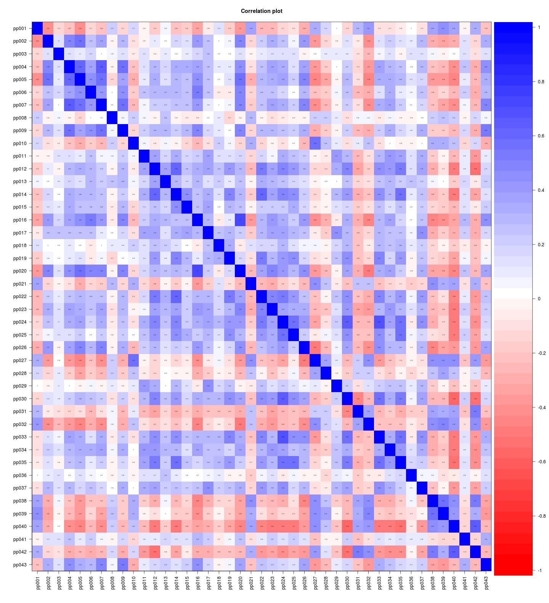
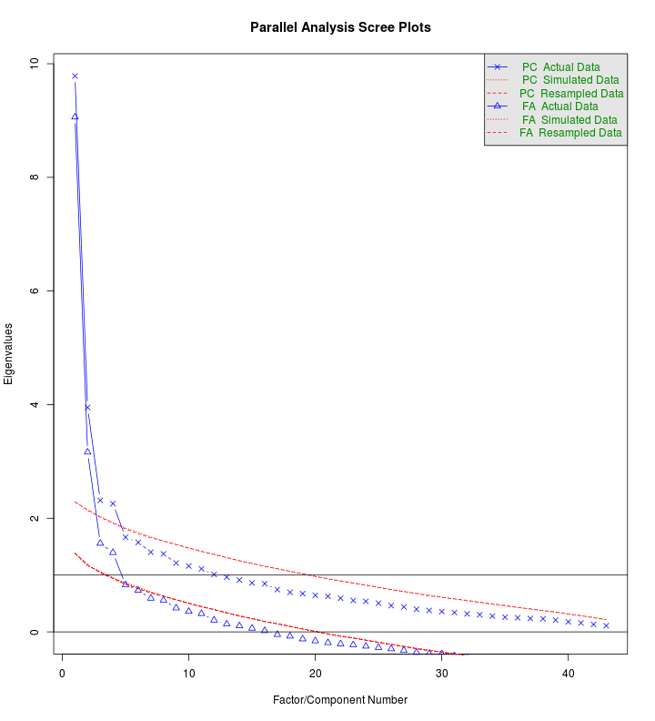
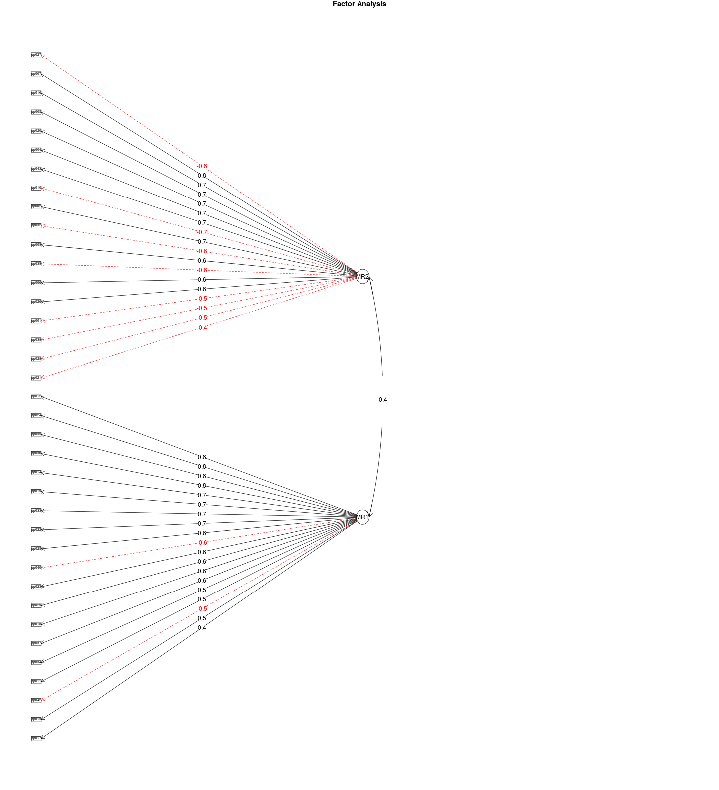

Questionário sobre práticas na prevenção do uso de álcool e outras drogas - Análise preliminar
================================================================================================

Este relatório objetiva apresentar as análises introdutória do instrumento ``Escala de práticas na prevenção do uso de álcool e outras drogas'', que está em fase de desenvolvimento pelo Centro de Referência em Pesquisa, Intervenção e Avaliação em Álcool e Outras Drogas (http://www.ufjf.br/crepeia/).

O instrumento está sendo validado para população de educadores. O objetivo da pesquisa é oferecer uma medida confiável para avaliação das práticas profissionais de educadores de um curso à distância oferecido pela Secretaria Nacional de Políticas sobre Drogas para aproximadamente 10.000 educadores dos estados de Minas Gerais e Rio de Janeiro.

Durante todo o processo de desenvolvimento, foram utilizadas ferramentas de código-aberto, para facilitar o re-uso das técnicas e procedimentos desenvolvidos. Todo conteúdo do instrumento e de suas etapas estará disponível para o público no repositório (http://github.com/crepeia/ead-senad). Atualmente, o projeto está hospedado no repositório (http://github.com/henriquepgomide/ead-senad). 

Neste relatório são apresentadas, análises da escala com base em uma amostra de 136 educadores-tutores do curso. As análises foram conduzidas através da linguagem de programação R usando os pacotes *car* e *psych*. 

Banco de Dados
-------------------------

O banco de dados da pesquisa, pode ser obtido no seguinte endereço: (https://github.com/henriquepgomide/ead-senad/blob/master/praticasprofissionais_df.csv).

Resultados
-------------------------

Os resultados são apresentados por tópicos: caracterização da amostra, avaliação descritiva da escala e análise fatorial exploratória.


### Bibliotecas

```r
library(car)  # Function Recode
library(psych)  # Function Describe
```

```
## 
## Attaching package: 'psych'
## 
## The following object is masked from 'package:car':
## 
##     logit
```

```r
praticasPro <- read.csv("praticasprofissionais_df.csv")
## Summing scales to remove NA's
praticasPro$scaleSum <- rowSums(praticasPro[, 21:63])
## Subset completed observations and consented participation
praticasPro <- subset(praticasPro, subset = praticasPro$termo == "Sim" & praticasPro$estado == 
    "Finalizadas" & !is.na(praticasPro$scaleSum))
```


### Sócio-demográficas

#### Idade

```r
idade <- as.character(praticasPro$idade)
idade[9] <- "35"
idade[44] <- "29"
idade[69] <- "31"
idade[111] <- 42
praticasPro$age <- as.numeric(gsub("anos(.*)", "", idade))
summary(praticasPro$age)  # all
```

```
##    Min. 1st Qu.  Median    Mean 3rd Qu.    Max. 
##    25.0    33.0    38.5    39.4    45.2    62.0
```

```r
by(praticasPro$age, praticasPro$sexo, describe)  #by sex
```

```
## praticasPro$sexo: Feminino
##   vars   n  mean  sd median trimmed  mad min max range skew kurtosis   se
## 1    1 118 38.91 8.5     38   38.34 8.15  26  62    36 0.57    -0.31 0.78
## -------------------------------------------------------- 
## praticasPro$sexo: Masculino
##   vars  n  mean   sd median trimmed  mad min max range  skew kurtosis  se
## 1    1 18 42.39 7.62     44   42.75 8.15  25  54    29 -0.52    -0.66 1.8
```


#### Sexo

```r
cbind(round(prop.table(table(praticasPro$sexo)), 2))
```

```
##           [,1]
## Feminino  0.87
## Masculino 0.13
```


#### Escolaridade

```r
cbind(round(prop.table(table(praticasPro$escolaridade)), 2))
```

```
##                          [,1]
## Ensino Superior Completo 0.09
## Pós-graduação            0.91
```


#### Estado Civil

```r
cbind(round(prop.table(table(praticasPro$estadocivil)), 2))
```

```
##                [,1]
## Casado (a)     0.50
## Divorciado (a) 0.13
## Outros         0.08
## Solteiro (a)   0.29
```


#### Tempo de serviço

```r
timeWorking <- as.character(praticasPro$tempo.atuacao)
praticasPro$timeWorking <- as.numeric(gsub("anos(.*)", "", timeWorking))
```

```
## Warning: NAs introduzidos por coerção
```

```r
describe(praticasPro$timeWorking)
```

```
##   vars   n  mean   sd median trimmed  mad min max range skew kurtosis   se
## 1    1 123 12.59 8.25     10   11.58 7.41   1  42    41    1     0.63 0.74
```


#### Religião

```r
cbind(round(prop.table(table(praticasPro$religiao)), 2))
```

```
##              [,1]
## Católica     0.53
## Espírita     0.17
## Evangélica   0.15
## Outras       0.06
## Sem religião 0.10
```


#### Contato com o tema

```r
cbind(round(prop.table(table(praticasPro$contato.tema)), 2))
```

```
##     [,1]
## Não 0.37
## Sim 0.63
```


#### Lida com

```r
cbind(round(prop.table(table(praticasPro$lida.com)), 2))
```

```
##     [,1]
## Não 0.36
## Sim 0.64
```


#### Onde lida com

```r
cbind(round(prop.table(table(praticasPro$onde.lida.com)), 2))
```

```
##                   [,1]
## Escola            0.51
## Família           0.27
## Outros            0.20
## Serviços de Saúde 0.03
```


### Apresentação dos itens da escala - Não implementado ainda!


```r
# questions <- read.csv('praticasprofissionais_questions.csv', col.names =
# 'Itens', header=FALSE) print(questions[1:42,1], type='html', justify =
# 'left' )
```


### Itens


```r
fullScale <- praticasPro[, 21:63]  # Versão completa da escala
describe(fullScale, skew = FALSE)
```

```
##       vars   n mean   sd median trimmed  mad min max range   se
## pp001    1 136 1.91 0.91      2    1.79 1.48   1   4     3 0.08
## pp002    2 136 4.48 0.58      5    4.53 0.00   3   5     2 0.05
## pp003    3 136 2.79 0.94      3    2.80 1.48   1   5     4 0.08
## pp004    4 136 4.35 0.56      4    4.36 0.00   3   5     2 0.05
## pp005    5 136 4.46 0.64      5    4.52 0.00   1   5     4 0.06
## pp006    6 136 3.97 0.84      4    4.05 1.48   2   5     3 0.07
## pp007    7 136 4.54 0.54      5    4.57 0.00   3   5     2 0.05
## pp008    8 136 2.88 0.89      3    2.91 1.48   1   5     4 0.08
## pp009    9 136 4.20 0.74      4    4.28 0.00   2   5     3 0.06
## pp010   10 136 1.77 0.73      2    1.69 1.48   1   4     3 0.06
## pp011   11 136 2.44 0.97      2    2.41 1.48   1   5     4 0.08
## pp012   12 136 3.72 0.80      4    3.78 0.00   1   5     4 0.07
## pp013   13 136 3.24 1.03      3    3.22 1.48   1   5     4 0.09
## pp014   14 136 3.43 0.93      4    3.45 1.48   1   5     4 0.08
## pp015   15 136 3.38 1.03      3    3.39 1.48   1   5     4 0.09
## pp016   16 136 4.14 0.70      4    4.21 0.00   2   5     3 0.06
## pp017   17 136 3.15 0.95      3    3.14 1.48   1   5     4 0.08
## pp018   18 136 3.17 1.06      3    3.20 1.48   1   5     4 0.09
## pp019   19 136 3.13 0.98      3    3.18 1.48   1   5     4 0.08
## pp020   20 136 4.35 0.61      4    4.40 0.00   3   5     2 0.05
## pp021   21 136 2.32 0.98      2    2.25 1.48   1   5     4 0.08
## pp022   22 136 3.76 0.80      4    3.81 0.00   2   5     3 0.07
## pp023   23 136 3.81 0.73      4    3.82 0.00   2   5     3 0.06
## pp024   24 136 3.82 0.87      4    3.91 0.00   1   5     4 0.07
## pp025   25 136 3.51 0.89      4    3.54 0.74   1   5     4 0.08
## pp026   26 136 4.30 0.67      4    4.36 0.00   1   5     4 0.06
## pp027   27 136 1.54 0.67      1    1.46 0.00   1   5     4 0.06
## pp028   28 136 1.96 0.88      2    1.86 1.48   1   5     4 0.08
## pp029   29 136 2.62 1.00      2    2.59 1.48   1   5     4 0.09
## pp030   30 136 3.21 0.93      3    3.22 1.48   1   5     4 0.08
## pp031   31 136 2.35 0.82      2    2.34 1.48   1   4     3 0.07
## pp032   32 136 1.73 0.99      1    1.53 0.00   1   5     4 0.09
## pp033   33 136 3.72 0.80      4    3.74 0.00   1   5     4 0.07
## pp034   34 136 3.82 0.72      4    3.83 0.00   1   5     4 0.06
## pp035   35 136 3.61 0.81      4    3.62 1.48   1   5     4 0.07
## pp036   36 136 3.10 0.89      3    3.12 1.48   1   5     4 0.08
## pp037   37 136 3.61 0.89      4    3.65 0.00   1   5     4 0.08
## pp038   38 136 1.96 0.82      2    1.89 1.48   1   4     3 0.07
## pp039   39 136 1.86 0.83      2    1.75 1.48   1   5     4 0.07
## pp040   40 136 2.47 0.91      2    2.45 1.48   1   5     4 0.08
## pp041   41 136 3.16 0.87      3    3.16 1.48   1   5     4 0.07
## pp042   42 136 2.26 0.87      2    2.19 0.00   1   5     4 0.07
## pp043   43 136 4.30 0.75      4    4.42 1.48   1   5     4 0.06
```


### Correlation Matrix

```r
cor.plot(cor(fullScale, method = "kendal", use = "complete.obs"), numbers = TRUE)
```

 


### Crobach's alfa

```r
alpha(fullScale)
```

```
## Warning: Some items were negatively correlated with total scale and were
## automatically reversed.
```

```
## 
## Reliability analysis   
## Call: alpha(x = fullScale)
## 
##   raw_alpha std.alpha G6(smc) average_r S/N   ase mean   sd
##        0.9      0.91    0.95      0.19  10 0.015  3.7 0.38
## 
##  lower alpha upper     95% confidence boundaries
## 0.88 0.9 0.93 
## 
##  Reliability if an item is dropped:
##        raw_alpha std.alpha G6(smc) average_r  S/N alpha se
## pp001-      0.90      0.91    0.95      0.19  9.9    0.015
## pp002       0.90      0.91    0.95      0.19  9.9    0.015
## pp003       0.91      0.91    0.95      0.20 10.3    0.014
## pp004       0.90      0.91    0.95      0.19  9.8    0.015
## pp005       0.90      0.91    0.95      0.19  9.8    0.015
## pp006       0.90      0.91    0.95      0.19  9.8    0.015
## pp007       0.90      0.91    0.95      0.19  9.8    0.015
## pp008-      0.91      0.91    0.95      0.20 10.3    0.014
## pp009       0.90      0.91    0.95      0.19  9.9    0.015
## pp010-      0.90      0.91    0.95      0.19 10.2    0.015
## pp011       0.90      0.91    0.95      0.19 10.0    0.015
## pp012       0.90      0.91    0.95      0.19  9.7    0.015
## pp013       0.90      0.91    0.95      0.19 10.1    0.015
## pp014       0.90      0.91    0.95      0.19  9.7    0.015
## pp015       0.90      0.91    0.95      0.19  9.9    0.015
## pp016       0.90      0.91    0.95      0.19  9.7    0.015
## pp017       0.90      0.91    0.95      0.19  9.8    0.015
## pp018       0.91      0.91    0.95      0.19 10.2    0.015
## pp019       0.90      0.91    0.95      0.19  9.9    0.015
## pp020       0.90      0.91    0.95      0.19  9.6    0.015
## pp021-      0.90      0.91    0.95      0.19  9.9    0.015
## pp022       0.90      0.91    0.95      0.19  9.7    0.015
## pp023       0.90      0.91    0.95      0.19  9.7    0.015
## pp024       0.90      0.91    0.95      0.19  9.7    0.015
## pp025       0.90      0.91    0.95      0.19  9.9    0.015
## pp026       0.90      0.91    0.95      0.19  9.8    0.015
## pp027-      0.90      0.91    0.95      0.19 10.0    0.015
## pp028-      0.90      0.91    0.95      0.19 10.0    0.015
## pp029       0.90      0.91    0.95      0.19 10.0    0.015
## pp030       0.90      0.91    0.95      0.19  9.7    0.015
## pp031-      0.90      0.91    0.95      0.19  9.9    0.015
## pp032-      0.90      0.91    0.95      0.19 10.0    0.015
## pp033       0.90      0.91    0.95      0.19  9.7    0.015
## pp034       0.90      0.91    0.95      0.19  9.7    0.015
## pp035       0.90      0.91    0.95      0.19  9.7    0.015
## pp036       0.91      0.91    0.95      0.20 10.3    0.014
## pp037       0.90      0.91    0.95      0.19  9.8    0.015
## pp038-      0.90      0.91    0.95      0.19  9.7    0.015
## pp039-      0.90      0.91    0.95      0.19  9.8    0.015
## pp040-      0.90      0.91    0.95      0.19  9.5    0.015
## pp041       0.90      0.91    0.95      0.19 10.1    0.015
## pp042-      0.90      0.91    0.95      0.19  9.6    0.015
## pp043       0.90      0.91    0.95      0.19  9.9    0.015
## 
##  Item statistics 
##          n    r r.cor r.drop mean   sd
## pp001- 136 0.42  0.41   0.37  4.1 0.91
## pp002  136 0.44  0.42   0.37  4.5 0.58
## pp003  136 0.19  0.16   0.14  2.8 0.94
## pp004  136 0.50  0.49   0.44  4.3 0.56
## pp005  136 0.52  0.51   0.45  4.5 0.64
## pp006  136 0.49  0.48   0.43  4.0 0.84
## pp007  136 0.53  0.52   0.46  4.5 0.54
## pp008- 136 0.16  0.13   0.10  3.1 0.89
## pp009  136 0.45  0.43   0.38  4.2 0.74
## pp010- 136 0.26  0.24   0.18  4.2 0.73
## pp011  136 0.38  0.36   0.35  2.4 0.97
## pp012  136 0.57  0.57   0.56  3.7 0.80
## pp013  136 0.31  0.29   0.26  3.2 1.03
## pp014  136 0.58  0.58   0.56  3.4 0.93
## pp015  136 0.45  0.43   0.41  3.4 1.03
## pp016  136 0.56  0.56   0.51  4.1 0.70
## pp017  136 0.48  0.48   0.45  3.1 0.95
## pp018  136 0.26  0.24   0.22  3.2 1.06
## pp019  136 0.45  0.45   0.44  3.1 0.98
## pp020  136 0.62  0.62   0.57  4.3 0.61
## pp021- 136 0.41  0.40   0.36  3.7 0.98
## pp022  136 0.56  0.56   0.54  3.8 0.80
## pp023  136 0.60  0.59   0.57  3.8 0.73
## pp024  136 0.60  0.60   0.57  3.8 0.87
## pp025  136 0.47  0.46   0.43  3.5 0.89
## pp026  136 0.49  0.48   0.43  4.3 0.67
## pp027- 136 0.38  0.37   0.31  4.5 0.67
## pp028- 136 0.34  0.32   0.29  4.0 0.88
## pp029  136 0.33  0.32   0.31  2.6 1.00
## pp030  136 0.60  0.60   0.58  3.2 0.93
## pp031- 136 0.45  0.43   0.41  3.6 0.82
## pp032- 136 0.36  0.34   0.30  4.3 0.99
## pp033  136 0.56  0.56   0.53  3.7 0.80
## pp034  136 0.55  0.54   0.52  3.8 0.72
## pp035  136 0.56  0.55   0.53  3.6 0.81
## pp036  136 0.17  0.14   0.13  3.1 0.89
## pp037  136 0.52  0.51   0.49  3.6 0.89
## pp038- 136 0.56  0.55   0.52  4.0 0.82
## pp039- 136 0.53  0.52   0.49  4.1 0.83
## pp040- 136 0.68  0.68   0.65  3.5 0.91
## pp041  136 0.30  0.27   0.24  3.2 0.87
## pp042- 136 0.62  0.62   0.60  3.7 0.87
## pp043  136 0.41  0.40   0.35  4.3 0.75
## 
## Non missing response frequency for each item
##          1    2    3    4    5 miss
## pp001 0.38 0.42 0.12 0.08 0.00    0
## pp002 0.00 0.00 0.04 0.43 0.52    0
## pp003 0.07 0.32 0.38 0.20 0.03    0
## pp004 0.00 0.00 0.04 0.57 0.39    0
## pp005 0.01 0.00 0.04 0.44 0.51    0
## pp006 0.00 0.07 0.17 0.49 0.27    0
## pp007 0.00 0.00 0.02 0.42 0.56    0
## pp008 0.07 0.24 0.46 0.21 0.02    0
## pp009 0.00 0.03 0.10 0.51 0.36    0
## pp010 0.38 0.49 0.11 0.02 0.00    0
## pp011 0.13 0.49 0.19 0.17 0.01    0
## pp012 0.01 0.09 0.19 0.60 0.11    0
## pp013 0.03 0.26 0.25 0.38 0.09    0
## pp014 0.01 0.18 0.26 0.46 0.09    0
## pp015 0.03 0.17 0.34 0.32 0.15    0
## pp016 0.00 0.03 0.10 0.58 0.29    0
## pp017 0.03 0.24 0.36 0.31 0.07    0
## pp018 0.07 0.19 0.31 0.35 0.08    0
## pp019 0.06 0.20 0.34 0.36 0.04    0
## pp020 0.00 0.00 0.07 0.51 0.42    0
## pp021 0.18 0.49 0.21 0.10 0.03    0
## pp022 0.00 0.08 0.22 0.55 0.15    0
## pp023 0.00 0.04 0.24 0.57 0.14    0
## pp024 0.01 0.07 0.17 0.56 0.18    0
## pp025 0.01 0.14 0.26 0.50 0.09    0
## pp026 0.01 0.01 0.05 0.54 0.39    0
## pp027 0.53 0.43 0.03 0.01 0.01    0
## pp028 0.33 0.45 0.16 0.05 0.01    0
## pp029 0.10 0.40 0.31 0.14 0.04    0
## pp030 0.03 0.19 0.38 0.33 0.07    0
## pp031 0.14 0.45 0.33 0.08 0.00    0
## pp032 0.51 0.35 0.06 0.04 0.04    0
## pp033 0.01 0.04 0.30 0.51 0.14    0
## pp034 0.01 0.03 0.24 0.60 0.13    0
## pp035 0.01 0.07 0.35 0.46 0.12    0
## pp036 0.04 0.20 0.43 0.29 0.04    0
## pp037 0.01 0.11 0.24 0.51 0.12    0
## pp038 0.31 0.47 0.18 0.04 0.00    0
## pp039 0.35 0.49 0.10 0.04 0.01    0
## pp040 0.12 0.45 0.29 0.12 0.01    0
## pp041 0.01 0.22 0.40 0.32 0.04    0
## pp042 0.16 0.52 0.23 0.07 0.01    0
## pp043 0.01 0.02 0.07 0.47 0.43    0
```


Análise Fatorial
----------------------

### KMO - Adequação da amostra

```r
KMO(fullScale)
```

```
## Kaiser-Meyer-Olkin factor adequacy
## Call: KMO(r = fullScale)
## Overall MSA =  0.81
## MSA for each item = 
## pp001 pp002 pp003 pp004 pp005 pp006 pp007 pp008 pp009 pp010 pp011 pp012 
##  0.75  0.82  0.53  0.79  0.80  0.81  0.92  0.59  0.82  0.64  0.78  0.86 
## pp013 pp014 pp015 pp016 pp017 pp018 pp019 pp020 pp021 pp022 pp023 pp024 
##  0.74  0.80  0.77  0.87  0.73  0.59  0.83  0.90  0.79  0.82  0.86  0.88 
## pp025 pp026 pp027 pp028 pp029 pp030 pp031 pp032 pp033 pp034 pp035 pp036 
##  0.82  0.82  0.75  0.74  0.73  0.90  0.82  0.71  0.87  0.85  0.87  0.50 
## pp037 pp038 pp039 pp040 pp041 pp042 pp043 
##  0.83  0.80  0.83  0.82  0.62  0.78  0.78
```


### Esfericidade

```r
bartlett.test(fullScale)
```

```
## 
## 	Bartlett test of homogeneity of variances
## 
## data:  fullScale
## Bartlett's K-squared = 300.9, df = 42, p-value < 2.2e-16
```


### Análise paralela

```r
fa.parallel(fullScale, fm = "minres", fa = "both", ylabel = "Eigenvalues")  # yields 3 components and 4 factors
```

```
## Loading required package: parallel
## Loading required package: MASS
```

 

```
## Parallel analysis suggests that the number of factors =  4  and the number of components =  4
```


### EFA - Principal component analysis

### Todos os itens


```r
faAll <- fa.poly(fullScale, nfactors = 2, rotate = "oblimin", fm = "minres")
```

```
## Loading required package: mvtnorm
## The items do not have an equal number of response alternatives, global set to FALSE
```

```
## Warning: Matrix was not positive definite, smoothing was done
```

```
## Loading required package: GPArotation
```

```r
print.psych(faAll, digits = 2, cut = 0.3)
```

```
## Factor Analysis using method =  minres
## Call: fa.poly(x = fullScale, nfactors = 2, rotate = "oblimin", fm = "minres")
## Standardized loadings (pattern matrix) based upon correlation matrix
##         MR1   MR2    h2   u2 com
## pp001 -0.55       0.318 0.68 1.0
## pp002  0.64       0.412 0.59 1.0
## pp003             0.046 0.95 1.1
## pp004  0.70       0.492 0.51 1.0
## pp005  0.72       0.577 0.42 1.0
## pp006  0.58       0.367 0.63 1.0
## pp007  0.76       0.600 0.40 1.0
## pp008             0.039 0.96 1.2
## pp009  0.59       0.374 0.63 1.0
## pp010 -0.66  0.30 0.378 0.62 1.4
## pp011        0.51 0.236 0.76 1.1
## pp012        0.82 0.636 0.36 1.0
## pp013        0.47 0.207 0.79 1.0
## pp014        0.75 0.561 0.44 1.0
## pp015        0.33 0.224 0.78 1.8
## pp016  0.75       0.588 0.41 1.0
## pp017        0.40 0.251 0.75 1.4
## pp018        0.57 0.278 0.72 1.4
## pp019        0.74 0.477 0.52 1.1
## pp020  0.71       0.627 0.37 1.1
## pp021 -0.42       0.244 0.76 1.2
## pp022        0.65 0.491 0.51 1.1
## pp023        0.57 0.472 0.53 1.3
## pp024        0.75 0.608 0.39 1.0
## pp025        0.64 0.402 0.60 1.0
## pp026  0.56       0.407 0.59 1.2
## pp027 -0.79       0.552 0.45 1.1
## pp028 -0.45       0.194 0.81 1.0
## pp029        0.57 0.280 0.72 1.3
## pp030        0.74 0.565 0.43 1.0
## pp031 -0.31       0.231 0.77 2.0
## pp032 -0.62       0.399 0.60 1.0
## pp033        0.69 0.534 0.47 1.0
## pp034        0.53 0.430 0.57 1.4
## pp035        0.76 0.562 0.44 1.0
## pp036             0.046 0.95 1.2
## pp037        0.55 0.383 0.62 1.2
## pp038 -0.55       0.427 0.57 1.3
## pp039 -0.60       0.439 0.56 1.1
## pp040 -0.32 -0.57 0.555 0.45 1.6
## pp041             0.100 0.90 1.1
## pp042 -0.33 -0.50 0.480 0.52 1.7
## pp043  0.68       0.440 0.56 1.0
## 
##                        MR1  MR2
## SS loadings           8.56 8.37
## Proportion Var        0.20 0.19
## Cumulative Var        0.20 0.39
## Proportion Explained  0.51 0.49
## Cumulative Proportion 0.51 1.00
## 
##  With factor correlations of 
##      MR1  MR2
## MR1 1.00 0.38
## MR2 0.38 1.00
## 
## Mean item complexity =  1.2
## Test of the hypothesis that 2 factors are sufficient.
## 
## The degrees of freedom for the null model are  903  and the objective function was  101.8 with Chi Square of  12195
## The degrees of freedom for the model are 818  and the objective function was  85.94 
## 
## The root mean square of the residuals (RMSR) is  0.09 
## The df corrected root mean square of the residuals is  0.1 
## 
## The harmonic number of observations is  136 with the empirical chi square  2170  with prob <  7e-123 
## The total number of observations was  136  with MLE Chi Square =  10184  with prob <  0 
## 
## Tucker Lewis Index of factoring reliability =  0.073
## RMSEA index =  0.312  and the 90 % confidence intervals are  0.285 0.295
## BIC =  6165
## Fit based upon off diagonal values = 0.9
## Measures of factor score adequacy             
##                                                MR1 MR2
## Correlation of scores with factors               1   1
## Multiple R square of scores with factors         1   1
## Minimum correlation of possible factor scores    1   1
```


### Versão com itens com boas cargas fatoriais

```r
v1Scale <- subset(fullScale, select = -c(3, 8, 15, 31, 36, 41))  # Criação da escala com itens de cargas fatoriais boas
faAll <- fa.poly(v1Scale, nfactors = 2, rotate = "oblimin", fm = "minres")
```

```
## The items do not have an equal number of response alternatives, global set to FALSE
```

```
## Warning: Matrix was not positive definite, smoothing was done
```

```r
print.psych(faAll, digits = 2, cut = 0.3)
```

```
## Factor Analysis using method =  minres
## Call: fa.poly(x = v1Scale, nfactors = 2, rotate = "oblimin", fm = "minres")
## Standardized loadings (pattern matrix) based upon correlation matrix
##         MR2   MR1   h2   u2 com
## pp001 -0.54       0.31 0.69 1.0
## pp002  0.65       0.43 0.57 1.0
## pp004  0.69       0.48 0.52 1.0
## pp005  0.73       0.60 0.40 1.0
## pp006  0.59       0.37 0.63 1.0
## pp007  0.77       0.61 0.39 1.0
## pp009  0.61       0.39 0.61 1.0
## pp010 -0.66       0.38 0.62 1.4
## pp011        0.52 0.24 0.76 1.1
## pp012        0.81 0.63 0.37 1.0
## pp013        0.46 0.20 0.80 1.0
## pp014        0.74 0.55 0.45 1.0
## pp016  0.74       0.58 0.42 1.0
## pp017        0.41 0.25 0.75 1.3
## pp018        0.56 0.27 0.73 1.4
## pp019        0.74 0.48 0.52 1.1
## pp020  0.71       0.63 0.37 1.1
## pp021 -0.41       0.24 0.76 1.3
## pp022        0.66 0.50 0.50 1.1
## pp023        0.57 0.47 0.53 1.3
## pp024        0.76 0.63 0.37 1.0
## pp025        0.65 0.41 0.59 1.0
## pp026  0.57       0.42 0.58 1.2
## pp027 -0.80       0.56 0.44 1.1
## pp028 -0.46       0.21 0.79 1.0
## pp029        0.57 0.28 0.72 1.3
## pp030        0.75 0.58 0.42 1.0
## pp032 -0.62       0.40 0.60 1.0
## pp033        0.70 0.55 0.45 1.0
## pp034        0.54 0.44 0.56 1.4
## pp035        0.76 0.56 0.44 1.0
## pp037        0.55 0.38 0.62 1.1
## pp038 -0.54       0.42 0.58 1.3
## pp039 -0.60       0.43 0.57 1.1
## pp040       -0.58 0.55 0.45 1.5
## pp042 -0.31 -0.52 0.48 0.52 1.6
## pp043  0.67       0.43 0.57 1.0
## 
##                        MR2  MR1
## SS loadings           8.18 8.14
## Proportion Var        0.22 0.22
## Cumulative Var        0.22 0.44
## Proportion Explained  0.50 0.50
## Cumulative Proportion 0.50 1.00
## 
##  With factor correlations of 
##      MR2  MR1
## MR2 1.00 0.38
## MR1 0.38 1.00
## 
## Mean item complexity =  1.1
## Test of the hypothesis that 2 factors are sufficient.
## 
## The degrees of freedom for the null model are  666  and the objective function was  91.45 with Chi Square of  11142
## The degrees of freedom for the model are 593  and the objective function was  76.18 
## 
## The root mean square of the residuals (RMSR) is  0.09 
## The df corrected root mean square of the residuals is  0.1 
## 
## The harmonic number of observations is  136 with the empirical chi square  1580  with prob <  9.8e-91 
## The total number of observations was  136  with MLE Chi Square =  9180  with prob <  0 
## 
## Tucker Lewis Index of factoring reliability =  0.069
## RMSEA index =  0.348  and the 90 % confidence intervals are  0.32 0.332
## BIC =  6266
## Fit based upon off diagonal values = 0.92
## Measures of factor score adequacy             
##                                                MR2 MR1
## Correlation of scores with factors               1   1
## Multiple R square of scores with factors         1   1
## Minimum correlation of possible factor scores    1   1
```


#### Diagrama com fatores

```r
fa.diagram(faAll)
```

 


