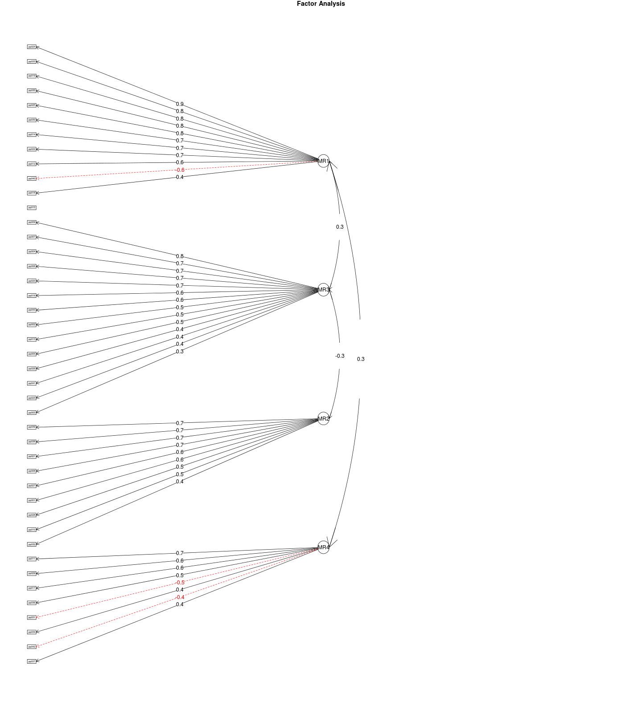

Questionário sobre práticas na prevenção do uso de álcool e outras drogas - Análise preliminar
================================================================================================

Este relatório objetiva apresentar as análises introdutória do instrumento ``Escala de práticas na prevenção do uso de álcool e outras drogas'', que está em fase de desenvolvimento pelo Centro de Referência em Pesquisa, Intervenção e Avaliação em Álcool e Outras Drogas (http://www.ufjf.br/crepeia/).

O instrumento está sendo validado para população de educadores. O objetivo da pesquisa é oferecer uma medida confiável para avaliação das práticas profissionais de educadores de um curso à distância oferecido pela Secretaria Nacional de Políticas sobre Drogas para aproximadamente 10.000 educadores dos estados de Minas Gerais e Rio de Janeiro.

Durante todo o processo de desenvolvimento, foram utilizadas ferramentas de código-aberto, para facilitar o re-uso das técnicas e procedimentos desenvolvidos. Todo conteúdo do instrumento e de suas etapas estará disponível para o público no repositório (http://github.com/crepeia/ead-senad). Atualmente, o projeto está hospedado no repositório (http://github.com/henriquepgomide/ead-senad). 

Neste relatório são apresentadas, análises da escala com base em uma amostra de 141 educadores-tutores do curso. As análises foram conduzidas através da linguagem de programação R usando os pacotes *car* e *psych*. 

Banco de Dados
-------------------------

O banco de dados da pesquisa, pode ser obtido no seguinte endereço: (https://github.com/henriquepgomide/ead-senad/blob/master/praticasprofissionais_df.csv).

Resultados
-------------------------

Os resultados são apresentados por tópicos: caracterização da amostra, avaliação descritiva da escala e análise fatorial exploratória.


### Bibliotecas

```r
library(car)  # Function Recode
library(psych)  # Function Describe
```

```
## 
## Attaching package: 'psych'
## 
## The following object is masked from 'package:car':
## 
##     logit
```

```r
praticasPro <- read.csv("praticasprofissionais_df.csv")
## Summing scales to remove NA's
praticasPro$scaleSum <- rowSums(praticasPro[, 24:66])
## Subset completed observations and consented participation
praticasPro <- subset(praticasPro, subset = praticasPro$termo == "Sim" & praticasPro$estado == 
    "Finalizadas" & !is.na(praticasPro$scaleSum))
```


### Sócio-demográficas

#### Idade

```r
idade <- as.character(praticasPro$idade)
idade[9] <- "35"
idade[43] <- "29"
idade[64] <- "31"
praticasPro$age <- as.numeric(gsub("anos(.*)", "", idade))
summary(praticasPro$age)  # all
```

```
##    Min. 1st Qu.  Median    Mean 3rd Qu.    Max. 
##    26.0    33.0    39.0    39.8    47.0    62.0
```

```r
by(praticasPro$age, praticasPro$sexo, describe)  #by sex
```

```
## praticasPro$sexo: Feminino
##   vars  n  mean  sd median trimmed mad min max range skew kurtosis   se
## 1    1 74 39.05 9.1     38   38.35 8.9  26  62    36 0.59    -0.39 1.06
## -------------------------------------------------------- 
## praticasPro$sexo: Masculino
##   vars  n  mean   sd median trimmed  mad min max range  skew kurtosis   se
## 1    1 11 44.82 5.88     47      45 4.45  34  54    20 -0.33    -1.11 1.77
```


#### Sexo

```r
cbind(round(prop.table(table(praticasPro$sexo)), 2))
```

```
##           [,1]
## Feminino  0.87
## Masculino 0.13
```


#### Escolaridade

```r
cbind(round(prop.table(table(praticasPro$escolaridade)), 2))
```

```
##                          [,1]
## Ensino Superior Completo 0.08
## Pós-graduação            0.92
```


#### Estado Civil

```r
cbind(round(prop.table(table(praticasPro$estadocivil)), 2))
```

```
##                [,1]
## Casado (a)     0.47
## Divorciado (a) 0.12
## Outros         0.08
## Solteiro (a)   0.33
```


#### Tempo de serviço

```r
timeWorking <- as.character(praticasPro$tempo.atuacao)
praticasPro$timeWorking <- as.numeric(gsub("anos(.*)", "", timeWorking))
```

```
## Warning: NAs introduced by coercion
```

```r
describe(praticasPro$timeWorking)
```

```
##   vars  n  mean   sd median trimmed mad min max range skew kurtosis   se
## 1    1 76 12.93 8.65     11   12.03 8.9   1  42    41 0.91     0.55 0.99
```


#### Religião

```r
cbind(round(prop.table(table(praticasPro$religiao)), 2))
```

```
##              [,1]
## Católica     0.49
## Espírita     0.15
## Evangélica   0.15
## Outras       0.09
## Sem religião 0.11
```


#### Contato com o tema

```r
cbind(round(prop.table(table(praticasPro$contato.tema)), 2))
```

```
##     [,1]
## Não 0.38
## Sim 0.62
```


#### Lida com

```r
cbind(round(prop.table(table(praticasPro$lida.com)), 2))
```

```
##     [,1]
## Não 0.36
## Sim 0.64
```


#### Onde lida com

```r
cbind(round(prop.table(table(praticasPro$onde.lida.com)), 2))
```

```
##                   [,1]
## Escola            0.53
## Família           0.18
## Outros            0.26
## Serviços de Saúde 0.03
```


### Apresentação dos itens da escala - Não implementado ainda!


```r
questions <- read.csv("praticasprofissionais_questions.csv", col.names = "Itens", 
    header = FALSE)
```

```
## Warning: cannot open file 'praticasprofissionais_questions.csv': No such
## file or directory
```

```
## Error: cannot open the connection
```

```r
print(questions[1:42, 1], type = "html", justify = "left")
```

```
## Error: object 'questions' not found
```


### Itens


```r
describe(praticasPro[, 24:66], skew = FALSE)
```

```
##       vars  n mean   sd median trimmed  mad min max range   se
## pp001    1 85 1.87 0.86      2    1.77 1.48   1   4     3 0.09
## pp002    2 85 4.52 0.59      5    4.58 0.00   3   5     2 0.06
## pp003    3 85 2.85 0.94      3    2.87 1.48   1   5     4 0.10
## pp004    4 85 4.38 0.60      4    4.42 0.00   3   5     2 0.06
## pp005    5 85 4.45 0.70      5    4.54 0.00   1   5     4 0.08
## pp006    6 85 3.91 0.84      4    3.96 1.48   2   5     3 0.09
## pp007    7 85 4.53 0.55      5    4.57 0.00   3   5     2 0.06
## pp008    8 85 2.92 0.94      3    2.96 1.48   1   5     4 0.10
## pp009    9 85 4.20 0.78      4    4.29 1.48   2   5     3 0.09
## pp010   10 85 1.74 0.79      2    1.64 1.48   1   4     3 0.09
## pp011   11 85 2.48 0.98      2    2.45 0.00   1   5     4 0.11
## pp012   12 85 3.68 0.80      4    3.72 0.00   2   5     3 0.09
## pp013   13 85 3.15 1.02      3    3.12 1.48   1   5     4 0.11
## pp014   14 85 3.33 0.99      4    3.33 1.48   1   5     4 0.11
## pp015   15 85 3.24 1.04      3    3.22 1.48   1   5     4 0.11
## pp016   16 85 4.16 0.75      4    4.26 0.00   2   5     3 0.08
## pp017   17 85 3.18 1.00      3    3.14 1.48   1   5     4 0.11
## pp018   18 85 3.13 1.13      3    3.16 1.48   1   5     4 0.12
## pp019   19 85 3.02 1.05      3    3.07 1.48   1   5     4 0.11
## pp020   20 85 4.39 0.58      4    4.42 0.00   3   5     2 0.06
## pp021   21 85 2.27 1.00      2    2.16 1.48   1   5     4 0.11
## pp022   22 85 3.78 0.82      4    3.84 0.00   2   5     3 0.09
## pp023   23 85 3.82 0.73      4    3.81 0.00   2   5     3 0.08
## pp024   24 85 3.80 0.97      4    3.90 1.48   1   5     4 0.11
## pp025   25 85 3.53 0.93      4    3.57 0.00   1   5     4 0.10
## pp026   26 85 4.34 0.68      4    4.41 0.00   1   5     4 0.07
## pp027   27 85 1.54 0.66      1    1.48 0.00   1   5     4 0.07
## pp028   28 85 2.00 0.93      2    1.90 1.48   1   5     4 0.10
## pp029   29 85 2.66 1.04      2    2.61 1.48   1   5     4 0.11
## pp030   30 85 3.31 0.98      3    3.32 1.48   1   5     4 0.11
## pp031   31 85 2.26 0.79      2    2.25 1.48   1   4     3 0.09
## pp032   32 85 1.73 1.03      1    1.51 0.00   1   5     4 0.11
## pp033   33 85 3.79 0.86      4    3.83 1.48   1   5     4 0.09
## pp034   34 85 3.88 0.76      4    3.91 0.00   1   5     4 0.08
## pp035   35 85 3.62 0.86      4    3.65 1.48   1   5     4 0.09
## pp036   36 85 3.01 0.93      3    3.01 1.48   1   5     4 0.10
## pp037   37 85 3.69 0.90      4    3.75 0.00   1   5     4 0.10
## pp038   38 85 1.93 0.84      2    1.87 1.48   1   4     3 0.09
## pp039   39 85 1.81 0.78      2    1.72 1.48   1   4     3 0.08
## pp040   40 85 2.34 0.76      2    2.35 1.48   1   4     3 0.08
## pp041   41 85 3.14 0.90      3    3.13 1.48   1   5     4 0.10
## pp042   42 85 2.18 0.83      2    2.13 0.00   1   5     4 0.09
## pp043   43 85 4.38 0.72      4    4.48 1.48   2   5     3 0.08
```


### Correlation Matrix

```r
cor.plot(cor(praticasPro[, 24:66], method = "kendal", use = "complete.obs"), 
    numbers = TRUE)
```

 


### Crobach's alfa

```r
alpha(praticasPro[, 24:66])
```

```
## Warning: Some items were negatively correlated with total scale and were
## automatically reversed.
```

```
## 
## Reliability analysis   
## Call: alpha(x = praticasPro[, 24:66])
## 
##   raw_alpha std.alpha G6(smc) average_r S/N   ase mean   sd
##       0.92      0.92    0.97      0.22  12 0.016  3.7 0.41
## 
##  lower alpha upper     95% confidence boundaries
## 0.89 0.92 0.95 
## 
##  Reliability if an item is dropped:
##        raw_alpha std.alpha G6(smc) average_r S/N alpha se
## pp001-      0.92      0.92    0.97      0.22  12    0.016
## pp002       0.92      0.92    0.97      0.22  12    0.016
## pp003       0.92      0.93    0.97      0.23  12    0.016
## pp004       0.92      0.92    0.97      0.22  12    0.017
## pp005       0.92      0.92    0.97      0.22  12    0.016
## pp006       0.92      0.92    0.97      0.22  12    0.017
## pp007       0.92      0.92    0.97      0.22  12    0.016
## pp008-      0.92      0.93    0.97      0.23  13    0.016
## pp009       0.92      0.92    0.97      0.22  12    0.017
## pp010-      0.92      0.93    0.97      0.23  12    0.016
## pp011       0.92      0.92    0.97      0.22  12    0.017
## pp012       0.92      0.92    0.97      0.22  12    0.017
## pp013       0.92      0.92    0.97      0.22  12    0.016
## pp014       0.91      0.92    0.97      0.22  12    0.017
## pp015       0.92      0.92    0.97      0.22  12    0.016
## pp016       0.92      0.92    0.97      0.22  12    0.017
## pp017       0.92      0.92    0.97      0.22  12    0.017
## pp018       0.92      0.93    0.97      0.23  12    0.016
## pp019       0.92      0.92    0.97      0.22  12    0.017
## pp020       0.92      0.92    0.97      0.22  12    0.017
## pp021-      0.92      0.92    0.97      0.22  12    0.016
## pp022       0.92      0.92    0.97      0.22  12    0.017
## pp023       0.92      0.92    0.97      0.22  12    0.017
## pp024       0.91      0.92    0.97      0.22  12    0.017
## pp025       0.92      0.92    0.97      0.22  12    0.017
## pp026       0.92      0.92    0.97      0.22  12    0.017
## pp027-      0.92      0.92    0.97      0.22  12    0.016
## pp028-      0.92      0.92    0.97      0.23  12    0.016
## pp029       0.92      0.92    0.97      0.23  12    0.016
## pp030       0.91      0.92    0.97      0.22  12    0.017
## pp031-      0.92      0.92    0.97      0.22  12    0.017
## pp032-      0.92      0.92    0.97      0.22  12    0.016
## pp033       0.92      0.92    0.97      0.22  12    0.017
## pp034       0.92      0.92    0.97      0.22  12    0.017
## pp035       0.92      0.92    0.97      0.22  12    0.017
## pp036       0.92      0.93    0.97      0.23  13    0.016
## pp037       0.92      0.92    0.97      0.22  12    0.017
## pp038-      0.92      0.92    0.97      0.22  12    0.017
## pp039-      0.92      0.92    0.97      0.22  12    0.017
## pp040-      0.91      0.92    0.97      0.21  11    0.017
## pp041       0.92      0.92    0.97      0.23  12    0.016
## pp042-      0.92      0.92    0.97      0.22  12    0.017
## pp043       0.92      0.92    0.97      0.22  12    0.016
## 
##  Item statistics 
##         n    r r.cor r.drop mean   sd
## pp001- 85 0.45  0.44   0.39  4.1 0.86
## pp002  85 0.46  0.46   0.40  4.5 0.59
## pp003  85 0.20  0.18   0.16  2.8 0.94
## pp004  85 0.57  0.57   0.51  4.4 0.60
## pp005  85 0.49  0.48   0.43  4.4 0.70
## pp006  85 0.51  0.50   0.45  3.9 0.84
## pp007  85 0.52  0.52   0.45  4.5 0.55
## pp008- 85 0.17  0.15   0.12  3.1 0.94
## pp009  85 0.51  0.50   0.45  4.2 0.78
## pp010- 85 0.26  0.25   0.19  4.3 0.79
## pp011  85 0.46  0.45   0.44  2.5 0.98
## pp012  85 0.65  0.65   0.65  3.7 0.80
## pp013  85 0.37  0.36   0.33  3.2 1.02
## pp014  85 0.63  0.64   0.62  3.3 0.99
## pp015  85 0.46  0.45   0.42  3.2 1.04
## pp016  85 0.62  0.61   0.57  4.2 0.75
## pp017  85 0.57  0.56   0.55  3.2 1.00
## pp018  85 0.22  0.21   0.20  3.1 1.13
## pp019  85 0.47  0.46   0.45  3.0 1.05
## pp020  85 0.65  0.65   0.60  4.4 0.58
## pp021- 85 0.42  0.41   0.37  3.7 1.00
## pp022  85 0.61  0.61   0.60  3.8 0.82
## pp023  85 0.63  0.62   0.60  3.8 0.73
## pp024  85 0.66  0.66   0.65  3.8 0.97
## pp025  85 0.52  0.52   0.50  3.5 0.93
## pp026  85 0.59  0.58   0.54  4.3 0.68
## pp027- 85 0.46  0.45   0.39  4.5 0.66
## pp028- 85 0.31  0.30   0.25  4.0 0.93
## pp029  85 0.36  0.35   0.34  2.7 1.04
## pp030  85 0.69  0.69   0.68  3.3 0.98
## pp031- 85 0.55  0.54   0.53  3.7 0.79
## pp032- 85 0.41  0.40   0.35  4.3 1.03
## pp033  85 0.62  0.62   0.61  3.8 0.86
## pp034  85 0.55  0.54   0.52  3.9 0.76
## pp035  85 0.55  0.54   0.53  3.6 0.86
## pp036  85 0.18  0.16   0.15  3.0 0.93
## pp037  85 0.47  0.46   0.44  3.7 0.90
## pp038- 85 0.56  0.55   0.52  4.1 0.84
## pp039- 85 0.52  0.51   0.47  4.2 0.78
## pp040- 85 0.80  0.80   0.78  3.7 0.76
## pp041  85 0.31  0.29   0.26  3.1 0.90
## pp042- 85 0.65  0.66   0.63  3.8 0.83
## pp043  85 0.41  0.40   0.35  4.4 0.72
## 
## Non missing response frequency for each item
##          1    2    3    4    5 miss
## pp001 0.38 0.44 0.13 0.06 0.00    0
## pp002 0.00 0.00 0.05 0.39 0.56    0
## pp003 0.07 0.29 0.38 0.24 0.02    0
## pp004 0.00 0.00 0.06 0.51 0.44    0
## pp005 0.01 0.00 0.05 0.41 0.53    0
## pp006 0.00 0.06 0.22 0.47 0.25    0
## pp007 0.00 0.00 0.02 0.42 0.55    0
## pp008 0.07 0.25 0.40 0.26 0.02    0
## pp009 0.00 0.04 0.12 0.46 0.39    0
## pp010 0.44 0.42 0.11 0.04 0.00    0
## pp011 0.11 0.53 0.16 0.18 0.02    0
## pp012 0.00 0.11 0.21 0.58 0.11    0
## pp013 0.02 0.29 0.27 0.33 0.08    0
## pp014 0.02 0.22 0.24 0.44 0.08    0
## pp015 0.04 0.21 0.36 0.26 0.13    0
## pp016 0.00 0.05 0.07 0.55 0.33    0
## pp017 0.04 0.22 0.36 0.28 0.09    0
## pp018 0.09 0.20 0.28 0.33 0.09    0
## pp019 0.08 0.24 0.31 0.33 0.05    0
## pp020 0.00 0.00 0.05 0.52 0.44    0
## pp021 0.20 0.48 0.21 0.06 0.05    0
## pp022 0.00 0.09 0.19 0.56 0.15    0
## pp023 0.00 0.02 0.29 0.52 0.16    0
## pp024 0.02 0.09 0.16 0.49 0.22    0
## pp025 0.02 0.14 0.21 0.53 0.09    0
## pp026 0.01 0.00 0.05 0.52 0.42    0
## pp027 0.52 0.45 0.02 0.00 0.01    0
## pp028 0.33 0.42 0.18 0.06 0.01    0
## pp029 0.08 0.46 0.24 0.16 0.06    0
## pp030 0.04 0.18 0.32 0.39 0.08    0
## pp031 0.15 0.49 0.29 0.06 0.00    0
## pp032 0.52 0.36 0.04 0.04 0.05    0
## pp033 0.01 0.05 0.28 0.46 0.20    0
## pp034 0.01 0.02 0.21 0.58 0.18    0
## pp035 0.01 0.07 0.34 0.44 0.14    0
## pp036 0.05 0.24 0.42 0.25 0.05    0
## pp037 0.01 0.11 0.21 0.52 0.15    0
## pp038 0.35 0.40 0.21 0.04 0.00    0
## pp039 0.38 0.47 0.12 0.04 0.00    0
## pp040 0.12 0.48 0.34 0.06 0.00    0
## pp041 0.01 0.26 0.35 0.33 0.05    0
## pp042 0.19 0.52 0.24 0.05 0.01    0
## pp043 0.00 0.04 0.04 0.45 0.48    0
```


Análise Fatorial
----------------------

### KMO - Adequação da amostra

```r
KMO(praticasPro[, 24:66])
```

```
## Kaiser-Meyer-Olkin factor adequacy
## Call: KMO(r = praticasPro[, 24:66])
## Overall MSA =  0.74
## MSA for each item = 
## pp001 pp002 pp003 pp004 pp005 pp006 pp007 pp008 pp009 pp010 pp011 pp012 
##  0.72  0.64  0.45  0.75  0.69  0.71  0.81  0.44  0.70  0.57  0.76  0.88 
## pp013 pp014 pp015 pp016 pp017 pp018 pp019 pp020 pp021 pp022 pp023 pp024 
##  0.67  0.79  0.66  0.83  0.74  0.48  0.67  0.81  0.70  0.75  0.80  0.79 
## pp025 pp026 pp027 pp028 pp029 pp030 pp031 pp032 pp033 pp034 pp035 pp036 
##  0.68  0.77  0.61  0.57  0.65  0.83  0.81  0.60  0.78  0.75  0.87  0.36 
## pp037 pp038 pp039 pp040 pp041 pp042 pp043 
##  0.77  0.70  0.85  0.86  0.48  0.75  0.68
```


### Esfericidade

```r
bartlett.test(praticasPro[, 24:66])
```

```
## 
## 	Bartlett test of homogeneity of variances
## 
## data:  praticasPro[, 24:66]
## Bartlett's K-squared = 205.2, df = 42, p-value < 2.2e-16
```


### Análise paralela

```r
fa.parallel(praticasPro[, 24:66], fm = "minres", fa = "both", ylabel = "Eigenvalues")  # yields 3 components and 4 factors
```

```
## Loading required package: parallel
## Loading required package: MASS
```

 

```
## Parallel analysis suggests that the number of factors =  4  and the number of components =  3
```


### EFA - Principal component analysis


```r
pca <- fa.poly(praticasPro[, 24:66], nfactors = 4, rotate = "oblimin", fm = "minres")
```

```
## Loading required package: mvtnorm
## The items do not have an equal number of response alternatives, global set to FALSE
```

```
## Warning: NaNs produced
## Warning: Matrix was not positive definite, smoothing was done
```

```
## Loading required package: GPArotation
```

```r
print.psych(pca, digits = 2, cut = 0.4)
```

```
## Factor Analysis using method =  minres
## Call: fa.poly(x = praticasPro[, 24:66], nfactors = 4, rotate = "oblimin", 
##     fm = "minres")
## Standardized loadings (pattern matrix) based upon correlation matrix
##         MR1   MR3   MR2   MR4   h2   u2 com
## pp001              0.57       0.44 0.56 1.2
## pp002        0.51             0.47 0.53 1.7
## pp003                         0.20 0.80 2.9
## pp004        0.74             0.66 0.34 1.2
## pp005        0.49             0.61 0.39 2.3
## pp006        0.73             0.60 0.40 1.4
## pp007        0.75             0.74 0.26 1.5
## pp008              0.66       0.44 0.56 1.6
## pp009        0.80             0.64 0.36 1.1
## pp010              0.53       0.45 0.55 2.0
## pp011                    0.65 0.54 0.46 1.2
## pp012  0.61                   0.71 0.29 1.7
## pp013        0.50  0.45       0.53 0.47 3.0
## pp014  0.70                   0.64 0.36 1.2
## pp015                         0.25 0.75 2.1
## pp016        0.64             0.70 0.30 1.6
## pp017                    0.58 0.53 0.47 1.4
## pp018  0.43                   0.32 0.68 2.6
## pp019  0.83                   0.66 0.34 1.5
## pp020        0.68             0.72 0.28 1.4
## pp021              0.71       0.55 0.45 1.2
## pp022  0.69                   0.60 0.40 1.1
## pp023                         0.47 0.53 3.0
## pp024  0.87                   0.80 0.20 1.1
## pp025  0.80                   0.61 0.39 1.0
## pp026        0.41             0.58 0.42 3.0
## pp027              0.58       0.66 0.34 2.0
## pp028              0.53       0.33 0.67 1.3
## pp029                    0.64 0.54 0.46 1.5
## pp030  0.71                   0.69 0.31 1.1
## pp031                   -0.49 0.49 0.51 2.0
## pp032              0.41       0.49 0.51 2.1
## pp033  0.85                   0.73 0.27 1.0
## pp034                         0.47 0.53 2.7
## pp035  0.81                   0.66 0.34 1.1
## pp036                    0.54 0.28 0.72 1.7
## pp037                         0.40 0.60 2.8
## pp038              0.74       0.67 0.33 1.2
## pp039              0.74       0.64 0.36 1.1
## pp040 -0.57                   0.77 0.23 2.0
## pp041                         0.19 0.81 1.5
## pp042                         0.62 0.38 3.1
## pp043        0.62             0.49 0.51 1.4
## 
##                        MR1  MR3  MR2  MR4
## SS loadings           7.73 6.85 5.35 3.66
## Proportion Var        0.18 0.16 0.12 0.09
## Cumulative Var        0.18 0.34 0.46 0.55
## Proportion Explained  0.33 0.29 0.23 0.16
## Cumulative Proportion 0.33 0.62 0.84 1.00
## 
##  With factor correlations of 
##       MR1   MR3   MR2   MR4
## MR1  1.00  0.33 -0.26  0.32
## MR3  0.33  1.00 -0.34  0.16
## MR2 -0.26 -0.34  1.00 -0.03
## MR4  0.32  0.16 -0.03  1.00
## 
## Mean item complexity =  1.7
## Test of the hypothesis that 4 factors are sufficient.
## 
## The degrees of freedom for the null model are  903  and the objective function was  275.6 with Chi Square of  18969
## The degrees of freedom for the model are 737  and the objective function was  252.3 
## 
## The root mean square of the residuals (RMSR) is  0.08 
## The df corrected root mean square of the residuals is  0.08 
## 
## The harmonic number of observations is  85 with the empirical chi square  882.8  with prob <  0.00017 
## The total number of observations was  85  with MLE Chi Square =  16694  with prob <  0 
## 
## Tucker Lewis Index of factoring reliability =  -0.128
## RMSEA index =  0.575  and the 90 % confidence intervals are  0.498 0.511
## BIC =  13420
## Fit based upon off diagonal values = 0.95
## Measures of factor score adequacy             
##                                                MR1 MR3 MR2 MR4
## Correlation of scores with factors               1   1   1   1
## Multiple R square of scores with factors         1   1   1   1
## Minimum correlation of possible factor scores    1   1   1   1
```


#### Diagrama com fatores

```r
fa.diagram(pca)
```

 


